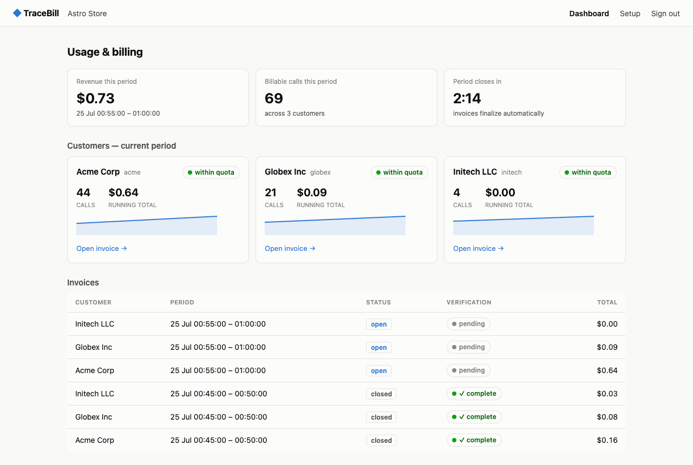
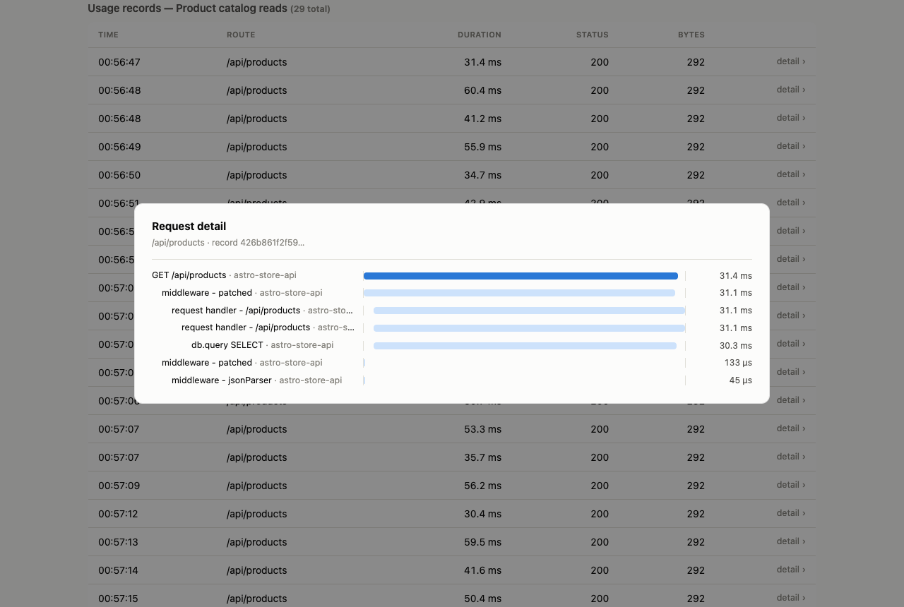

# TraceBill

**Usage-based billing that can prove itself.** Every charge on a TraceBill invoice
opens up into the individual API requests behind it.

## The problem

If you bill per API call, two things are painful. Setting it up means building a
whole second pipeline just to count usage. And when a customer asks "why is this
month $4,000?", the honest answer is usually "because our counter says so" — you
have a number, not evidence.

TraceBill takes a different route. Your API already reports what it's doing; that
telemetry *is* the billing data. So metering is one line of setup, and because every
charge traces back to a real request, the invoice comes with its own receipts.

## Setting it up

```js
const tracebill = require('@tracebill/node');
tracebill.init({
  key: process.env.TRACEBILL_KEY,
  identify: (req) => apiKeyToCustomer(req),   // who to bill for this request
});
```

That's the integration. No usage events to send, no counters to maintain.

## What you get

- **A live dashboard.** Usage and revenue as they happen, per customer, with the
  running total for the current billing period.
- **Invoices with receipts.** Click any line item to see the individual requests
  behind it — time, route, duration, response size. Click a request to see exactly
  where its time went and how its cost breaks down.
- **A link you can send your customer.** Read-only, scoped to their invoice alone.
  They can audit every charge themselves instead of taking your word for it.
- **A verification badge.** Each invoice cross-checks its own charges against the
  per-request evidence on file, so you know the total is backed up before you send it.
- **Spend limits that hold.** Give a customer a quota and TraceBill turns it off at
  your API's edge when they cross it. Refused calls are recorded, never billed.





## Try it

You need Docker. Nothing else — no accounts, no API keys, no config.

```bash
docker compose up -d
```

First run takes a few minutes while it downloads and sets itself up. Then open
**http://localhost:4500** and sign in with the credentials it printed:

```bash
docker compose logs app | grep -A2 Dashboard
```

Nothing is billed until traffic arrives, so send some. This drives a demo store API
as three different customers:

```bash
docker compose exec demo node demo/traffic.js
```

Watch the dashboard fill in, then open an invoice, click a line item, and click one
of the requests underneath it.

To stop, `docker compose down` — or `docker compose down -v` to also throw away the
data and start fresh.

## Pricing rules

Prices live in [`pricing.yaml`](pricing.yaml) — per-endpoint rates, free tiers,
compute and bandwidth, and per-customer quotas. Edit it and the change applies on
the next billing cycle.

## More

- [How it works](docs/ARCHITECTURE.md) — architecture, billing guarantees, security
  model, and what's built versus what isn't.
- Tests: `npm test` for the unit suite, `npm run test:e2e` for the full pipeline.

MIT licensed.
